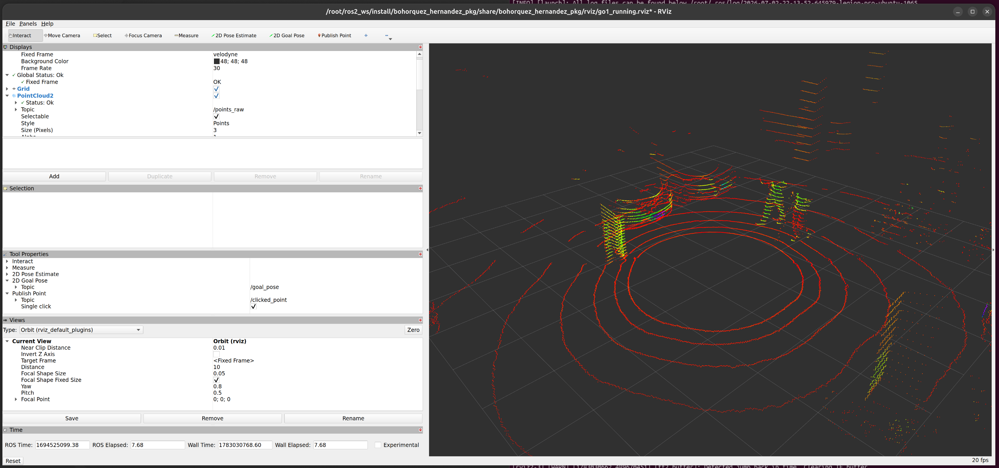

# bohorquez_hernandez_pkg



TP de ROS 2 (Jazzy): reproduce un rosbag y lo muestra en RViz y RQT con un solo launch.

## El rosbag

Uso la secuencia `running` del dataset [Leg-KILO](https://github.com/ouguangjun/legkilo-dataset): quería un rosbag de un robot en movimiento, de cuatro patas y parecido a Spot de Boston Dynamics.

### Descarga y conversión

Está en ROS 1, estos son los pasos para convertirlo 

```bash
# Bajar running.bag de la carpeta del dataset:
# https://drive.google.com/drive/folders/1Egpj7FngTTPCeQDEzlbiK3iesPPZtqiM

# para instalar rosbags local
sudo apt install -y pipx
pipx ensurepath
pipx install rosbags

# para hacer la conversion
mkdir -p ~/tp_ros2_bags
rosbags-convert --src running.bag --dst ~/tp_ros2_bags/running \
  --dst-storage mcap --dst-typestore ros2_jazzy \
  --exclude-topic /high_state
```

Esta excluido /high_state porque no era compatible con ROS2.
## Build

Una sola vez, para compilar el paquete:

```bash
colcon build --packages-select bohorquez_hernandez_pkg --symlink-install
source install/setup.bash
```

## Correr todo

Con un solo launch se abre todo:

```bash
ros2 launch bohorquez_hernandez_pkg bag_demo.launch.py
```

Esto levanta junto el rosbag, RViz y RQT.
