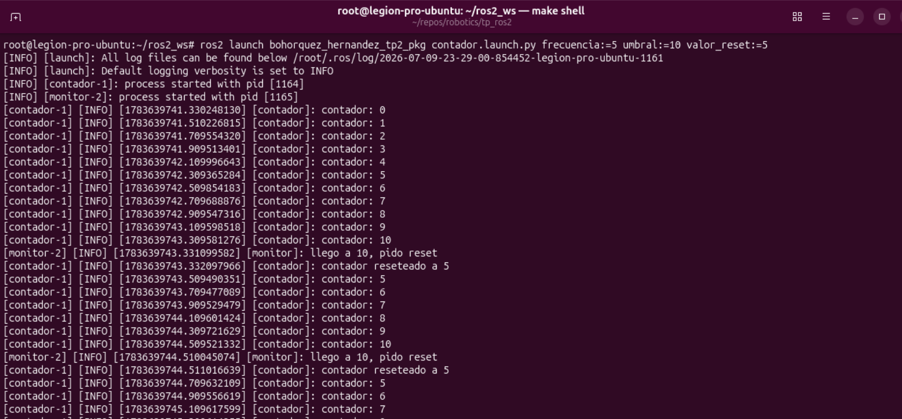
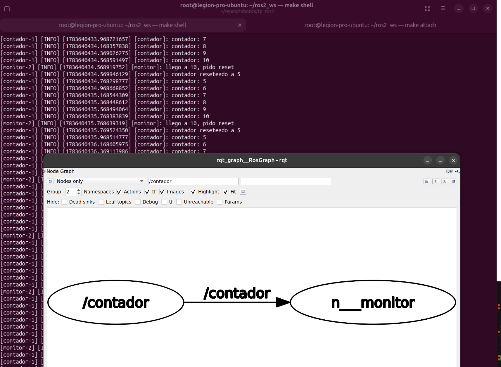
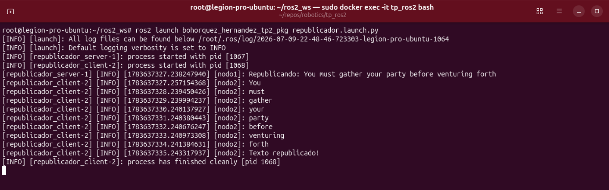

# TP2: servicios, parámetros y actions

## Ejercicio 1: contador con servicio

Un nodo `contador` publica un número en `/contador` 5 veces por segundo y expone un servicio
`reset_contador`. Un nodo `monitor` se suscribe y, cuando el contador llega al umbral (50 por
defecto, o sea cada 10 s), llama al servicio para reiniciarlo.

Parámetros:
- `contador`: `frecuencia` (Hz) y `max_cuenta`.
- `monitor`: `valor_reset` (a qué número reinicia) y `umbral` (a qué valor dispara el reset).

El launch permite configurar esos valores como argumentos:

```bash
ros2 launch bohorquez_hernandez_tp2_pkg contador.launch.py
ros2 launch bohorquez_hernandez_tp2_pkg contador.launch.py frecuencia:=10 umbral:=20 valor_reset:=5
```

El contador sube hasta el umbral, el `monitor` lo detecta y el servicio lo resetea:



Los dos nodos comunicándose por el topic `/contador` (rqt_graph):



## Ejercicio 2: republicador con action

Un action server `nodo1` recibe un texto y manda cada palabra como respuesta a 1 Hz. El
action client `nodo2` envía el texto, va imprimiendo cada palabra que le llega y, al terminar,
muestra "Texto republicado!"

El roslaunch permite configurar el texto.

```bash
ros2 launch bohorquez_hernandez_tp2_pkg republicador.launch.py
ros2 launch bohorquez_hernandez_tp2_pkg republicador.launch.py texto:="hola mundo"
```

El server manda cada palabra y el client las imprime hasta el "Texto republicado!":



## Build

Desde el workspace (ver el [README principal](../README.md) para levantar Docker):

```bash
colcon build --packages-up-to bohorquez_hernandez_tp2_pkg
source install/setup.bash
```
